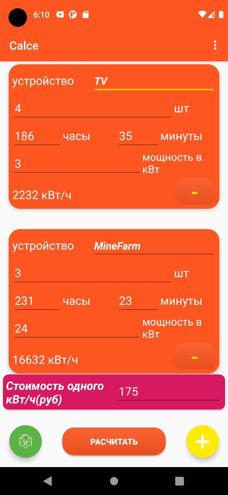
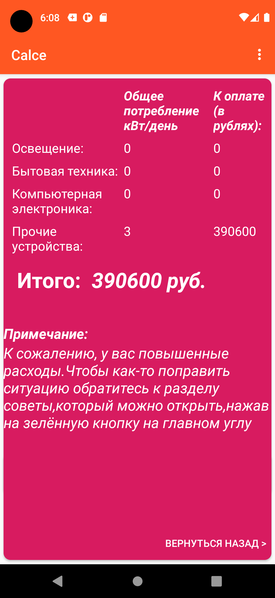

# Учебный проект Calce_app - калькулятор трат электроэнергии

## 📌 Описание проекта

**Calce_app** — это мобильное Android-приложение, реализованное на Java/Kotlin с использованием Gradle. Судя по структуре проекта, это **калькулятор / утилита с пользовательским интерфейсом**, предназначенная для расчёта затрат электроэнергии на Android-устройстве. Приложение использует стандартные модули Android SDK и организовано как типичный Gradle-проект.
Данный проект является учебным

## 🛠️ Технологии и библиотеки

Проект создан с использованием следующих технологий:

### 📌 Языки
- Java (основной язык Android-приложения) :contentReference[oaicite:2]{index=2}

### 📌 Инструменты / Сборка
- **Android SDK** — платформа разработки Android-приложений :contentReference[oaicite:3]{index=3}
- **Gradle** — система автоматизированной сборки проекта (`build.gradle`, `gradle.properties`, `gradlew`) :contentReference[oaicite:4]{index=4}
- **Android Studio** — рекомендуемая IDE для разработки :contentReference[oaicite:5]{index=5}

### 📌 Структура проекта
- `app/` — исходный код Android-приложения :contentReference[oaicite:6]{index=6}
- `gradle/` — файлы конфигурации Gradle :contentReference[oaicite:7]{index=7}

## 📸 Скриншоты

*Главный экран приложения — калькулятор*

*Ввод чисел и операций*

## 🚀 Как запустить проект

### ⚙️ Требования
- Android Studio (последняя версия)
- Android SDK
- Java JDK 8 или выше